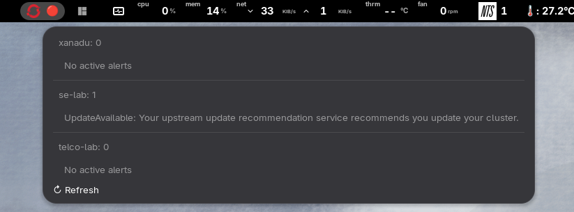

# GNOME Shell OpenShift Alerts Extension

A GNOME Shell extension that displays OpenShift cluster alerts in your desktop panel. This extension monitors multiple OpenShift clusters and provides real-time alert notifications.



## Features

- 🟢 **Visual Status Indicator**: Shows overall cluster health at a glance
  - 🟢 Green: All clusters healthy
  - 🟡 Yellow: One or more clusters unreachable
  - 🔴 Red: Active alerts detected
- **Multi-Cluster Support**: Monitor multiple OpenShift clusters simultaneously
- **Popup Menu**: Click the indicator to see detailed alert information
- **Auto-Refresh**: Automatically checks for new alerts every 60 seconds
- **Configurable**: Filter alerts by severity (critical, warning, etc.)

## Requirements

- GNOME Shell 48
- OpenShift cluster access with valid API tokens
- Network connectivity to cluster Alertmanager endpoints

## Installation

### 1. Install the Extension

Copy the extension files to your GNOME Shell extensions directory:

```bash
# Create the extension directory
mkdir -p ~/.local/share/gnome-shell/extensions/openshift-alerts@dcritch.github.com

# Copy extension files
cp metadata.json extension.js stylesheet.css \
   ~/.local/share/gnome-shell/extensions/openshift-alerts@dcritch.github.com/
```

### 2. RBAC

The extension requires a valid OpenShift API token to access the cluster. To keep things simple, create a service account with AlertManager access, and generate a token:

```bash
cat << EOF | oc apply -f -
---
apiVersion: v1
kind: ServiceAccount
metadata:
  name: ocp-alerts
  namespace: openshift-monitoring
---
apiVersion: rbac.authorization.k8s.io/v1
kind: Role
metadata:
  name: ocp-alerts
  namespace: openshift-monitoring
rules:
- apiGroups:
  - monitoring.coreos.com
  resourceNames:
  - main
  resources:
  - alertmanagers/api
  verbs:
  - 'list'
---
apiVersion: rbac.authorization.k8s.io/v1
kind: RoleBinding
metadata:
  name: ocp-alerts
  namespace: openshift-monitoring
roleRef:
  apiGroup: rbac.authorization.k8s.io
  kind: Role
  name: monitoring-alertmanager-edit
subjects:
- kind: ServiceAccount
  name: ocp-alerts
  namespace: openshift-monitoring
---
apiVersion: v1
kind: Secret
metadata:
  name: ocp-alerts
  namespace: openshift-monitoring
  annotations:
    kubernetes.io/service-account.name: "ocp-alerts"
type: kubernetes.io/service-account-token
EOF
serviceaccount/ocp-alerts created
role.rbac.authorization.k8s.io/ocp-alerts created
rolebinding.rbac.authorization.k8s.io/ocp-alerts created
secret/ocp-alerts created
```

To retrieve the token:

```bash
oc get secret ocp-alerts -n openshift-monitoring -o jsonpath='{.data.token}' | base64 --decode
```

### 3. Configure Clusters

Create the configuration directory and file:

```bash
mkdir -p ~/.config/ocp-alerts
cp clusters.yaml.example ~/.config/ocp-alerts/clusters.yaml
```

Edit `~/.config/ocp-alerts/clusters.yaml` with your cluster information:

```yaml
clusters:
  my-cluster:
    url: https://alertmanager-main-openshift-monitoring.apps.mycluster.example.com
    token: <service-account-token>
    severity: [critical, warning]
```

> **_NOTE_** The AlertManager URL can be discovered by `oc get route alertmanager-main -n openshift-monitoring -o jsonpath='{.spec.host}'`


### 4. Enable the Extension

After copying the files and configuring your clusters:

```bash
# Restart GNOME Shell
# On Wayland: Log out and log back in
# On X11: Press Alt+F2, type 'r', and press Enter

# Enable the extension
gnome-extensions enable openshift-alerts@dcritch.github.com
```

Or use GNOME Extensions app to enable it.

## Configuration

### Config File Format

The configuration file uses YAML format:

```yaml
clusters:
  cluster-name:
    url: <alertmanager-url>
    token: <api-token>
    severity: [critical, warning, info]
```

**Parameters:**
- `cluster-name`: A friendly name for your cluster (displayed in the menu)
- `url`: The Alertmanager API endpoint URL
- `token`: Your OpenShift API token
- `severity`: Array of severity levels to monitor (critical, warning, info)

### Multiple Clusters

You can monitor multiple clusters by adding additional entries:

```yaml
clusters:
  production:
    url: https://alertmanager.prod.example.com
    token: sha256~prod-token
    severity: [critical, warning]
  
  staging:
    url: https://alertmanager.staging.example.com
    token: sha256~staging-token
    severity: [critical]
  
  development:
    url: https://alertmanager.dev.example.com
    token: sha256~dev-token
    severity: [critical, warning]
```

## Usage

1. **Status Indicator**: The emoji in your panel shows the overall status:
   - 🟢 All clusters are healthy
   - 🟡 At least one cluster is unreachable
   - 🔴 Active alerts are present

2. **View Alerts**: Click the status indicator to open the menu and see:
   - Alert counts per cluster
   - Detailed alert information
   - Alert names and descriptions

3. **Manual Refresh**: Click "↻ Refresh" in the menu to immediately check for new alerts

## Troubleshooting

### Extension Not Appearing

1. Check that files are in the correct location:
   ```bash
   ls ~/.local/share/gnome-shell/extensions/openshift-alerts@dcritch.github.com/
   ```

2. Check for errors in the logs:
   ```bash
   journalctl -f -o cat /usr/bin/gnome-shell
   ```

3. Verify the extension is enabled:
   ```bash
   gnome-extensions list --enabled
   ```

### No Alerts Showing

1. Verify your config file exists and is valid:
   ```bash
   cat ~/.config/ocp-alerts/clusters.yaml
   ```

2. Test connectivity to your cluster:
   ```bash
   curl -k -H "Authorization: Bearer YOUR_TOKEN" \
     https://alertmanager-url/api/v2/alerts
   ```

3. Check the GNOME Shell logs for errors:
   ```bash
   journalctl -f -o cat /usr/bin/gnome-shell | grep -i openshift
   ```

### SSL Certificate Issues

By default, the extension accepts all SSL certificates, including self-signed ones. This is configured in `extension.js` using libsoup3's `accept-certificate` signal handler.

**To disable SSL verification (current default):**

The extension currently includes this code in the `_fetchAlertsForCluster` method:

```javascript
// Accept all certificates (including self-signed)
message.connect('accept-certificate', () => {
    return true;
});
```

**To enable strict SSL verification:**

Remove or comment out the `accept-certificate` signal handler in `extension.js`:

```javascript
// Strict SSL verification - comment out or remove this block:
// message.connect('accept-certificate', () => {
//     return true;
// });
```

Alternatively, you can make it conditional based on certificate validation:

```javascript
// Only accept valid certificates or specific self-signed ones
message.connect('accept-certificate', (message, cert, errors) => {
    // Log the certificate errors for debugging
    log(`Certificate errors: ${errors}`);
    
    // Return false to enforce strict SSL verification
    // Return true to accept the certificate
    return false;  // Change to 'true' to accept self-signed certs
});
```

After modifying the code, restart GNOME Shell or re-enable the extension for changes to take effect.

## Development

### Debugging

To see debug output:

```bash
# Watch GNOME Shell logs
journalctl -f -o cat /usr/bin/gnome-shell

# Or use Looking Glass (Alt+F2, type 'lg')
# Then check the Extensions tab
```

### Reload Extension

After making changes:

```bash
# Disable
gnome-extensions disable openshift-alerts@dcritch.github.com

# Re-enable
gnome-extensions enable openshift-alerts@dcritch.github.com
```

## License

MIT License - Feel free to modify and distribute as needed.

## Contributing

Contributions are welcome! Please feel free to submit issues or pull requests.

## Related Projects

- Original Argos Python script: [ocp-alerts.py](https://github.com/dcritch/argos-ocp-alerts)
- OpenShift Documentation: https://docs.openshift.com/

## Changelog

### Version 1.0
- Initial release
- Support for GNOME Shell 48
- Multi-cluster monitoring
- Configurable severity filtering
- Auto-refresh every 60 seconds

